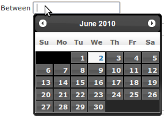

Grails jQuery UI Plugin
=======================

Simply supplies jQuery UI resources, depends on jQuery plugin. Use this plugin to avoid resource duplication and conflicts.

Installation
------------

Most common way:
```
grails install-plugin jquery-ui
```

Or, to get the last version:

* use the link above to download the archive from Github,
* place it in the lib directory of your Grails project,
* rename it to `jquery-ui-<version>`
* install the plugin:
   ```
   grails install-plugin jquery-ui <version>
   ```
  
* or, if you use the Maven 2 integration for Grails:

   ```
   mvn org.grails:grails-maven-plugin:install-plugin -DpluginName=jquery-ui -DpluginVersion=<version>
   ```
  
Description
-----------

### Overview
This plugin supplies jQuery UI resources, and depends on the jQuery plugin to include the core jquery libraries.

Use this plugin in your own apps and plugins to avoid resource duplication and conflicts. It includes all the standard widgets and effects, so that you don't have to worry about anything being missing - plus there is no workable "module" system for jQuery UI that I know of at this time.

When you have done your initial development and are ready for production, you may want to optimize these resources / use some minifying on them.

**This plugin supports the Grails Resources framework**

### Note for developers working with this plugin

This plugin just provides the resources and a tag to include them. It must not include tags to add new functionality / wrap jQ UI features.
**You must not change the theme shipped with the plugin, and you must include all the standard jQuery UI widget**
If you need a newer version of jQuery UI than is currently available with this plugin you can update this plugin it in grails SVN yourself. The original author has no desire to manage releases - provided you follow the clear conventions set out, all users of this plugin will be happy! Be my guest and release new versions as and when - just don't break anything for existing users. That means:
* Always include jqueryui resources that include all widgets and effects
* Always include the default theme as `ui-lightness`
* Don't add any functionality tags to this plugin
* Only update the jquery core library dependency when absolutely necessary, i.e. when jquery ui requires it.
*IMPORTANT:* The version number of the plugin and the jquery ui distribution is not always the same. Sometimes you have plugin point releases to fix problems. As a result it does not automatically use the plugin's version number to insert the correct jquery ui resources. When changing the jquery ui resource versions included in the plugin source, you must also change the `JQUERYUI_VERSION` constant in [JqueryUiGrailsPlugin.groovy](./JqueryUiGrailsPlugin.groovy) - or the `<jqui:resources/>` tag will not pull in the correct css and js files.

### Conventions
The version number of this plugin must always follow the version number of the jQuery UI version it bundles, with possible 4th-level point releases for patches/iterations of the plugin with the same jQuery library.

E.g. the first release of this plugin is 1.8 - because it ships jQuery UI 1.8. If jQuery UI upgrades to 1.8.2 or similar, this plugin would need to be upgraded to use it and use the version number 1.8.2. If there was a problem with the grails plugin release, this might change to 1.8.2.1 or 1.8.2.2 etc.

The key part is that any apps/plugins can install or `dependsOn "jquery-ui"` of a given version e.g. 1.8 to pull in that version of jQuery UI.

This plugin must dependsOn the minimum version of jQuery required by the jQuery UI version. E.g. in this release that is jQuery 1.3.2+ which is a separate grails plugin (1.3.2.1) that also matches this versioning convention


### Using jQuery UI with the Resources framework
This plugin integrates fully with the Grails resources framework. By installing this plugin you automatically get modules declared for jQuery UI and also for jQuery (because of Grails transitive plugin dependencies).

The modules available are:

* `jquery-ui` - The core jQuery UI code, which automatically depends on query.
* `jquery-theme` - The default jQuery `lightness` theme. The jQuery-UI module depends on this module automatically. You can override the CSS file of this resource using the Resources framework. The CSS resource's id is "theme". Alternatively you can override the `dependsOn 'jquery-ui'` to depend on some other module you define containing your theme.
* `jquery-ui-dev` - The non-minified version of jQuery for development mode.

### Usage with the Resources framework

Simple add the following to your GSP or site mesh layout:
```gsp
<r:require module="jquery-ui"/>
```

### Overriding the Default Theme

If you are using the jquery-ui plugin with the [Resources](http://grails.org/plugin/resources) Framework, you can easily override the `jquery-theme` module to use your own custom jQuery theme. See Resources Framework Documentation for more details.
```groovy
grails.resources.modules = {
  …
  overrides {
    'jquery-theme' {
      resource id:'theme', url:'/css/path/to/jquery-ui-1.8.17.custom.css'
	  }
  }
}
```

Everything else is done for you. You do not need any of the legacy tags or configuration specified in the rest of this documentation.

### Legacy Tags
**NOTE: These tags are only for developers not using the Grails Resources framework**

There is one tag - `<jqui:resources/>` - which pulls in the resources needed. It does **not** currently pull in the core jQuery resources, you should use the `<g:javascript lib="jquery"/>` tag for that.

You can override the theme used by jQuery UI by specifying the `theme` attribute with a value of the theme name, and the theme will then be located by pulling it from your app using the path:
```
<appcontext>/jquery-ui/themes/<themename>/jquery-ui-<ver>.custom.css
```
or, by using the `themeDir` attribute:
```
<appcontext>/<themeDir>/<themename>/jquery-ui-<ver>.custom.css
```
Alternatively you may want to specify the full URI to the theme CSS so that your custom themes work even if the version of jquery ui plugin you use changes. To do this, specify `themeCss`:
```gsp
<jqui:resources themeCss="/path/to/your/custom-1.8.3.css"/>
```

### Configuration
**Like any config param you can make those below environment specific (e.g `minified=false` for DEV, and `cdn='googlecode'` for production)**

#### minified
You can choose if the minified version of the .js shoud be used (or not) by using the following config parameter
```
jqueryUi.minified = true|false ;
```
default: serve minified

#### Google CDN
If yout want to load the resources from the Google CDN (which makes a lot of sense for high traffic sites), you can specifiy
```
jqueryUi.cdn = 'googlecode'
```
default: loading from CDN is disabled.


### Date Picker example
Here is the code for a gsp view using [datePicker](http://jqueryui.com/demos/datepicker):

`testDatePicker.gsp`

```gsp
<html>
  <head>
    <title>Simple GSP page</title>
    <g:javascript library="jquery" />
    <jqui:resources theme="darkness" />
    <script type="text/javascript">
        $(document).ready(function()
        {
          $("#datepicker").datepicker({dateFormat: 'yy/mm/dd'});
        })
    </script>

  </head>
  <body>
    <div>
      <p> Between <input type="text" id="datepicker"> </p>        
    </div>

  </body>
</html>
```

Don't forget to add a def to your controller to test it
```groovy
def testDatePicker = {
}
```



Where the theme `ui-darkness` have been downloaded from the [jQuery themeroller](http://jqueryui.com/themeroller/) page and the directory `css/ui-darkness` has been extracted from the zip file to the directory `home/xxx/myProject/web-app/jquery-ui/themes/`.

N.B.: you may have to rename the file `/home/xxx/myProject/web-app/jquery-ui/themes/ui-darkness/jquery-ui-1.8.1.custom.css` to match with your jquery version (e.g., in this case, `jquery-ui-1.8.1.custom.css` had to be renamed to `jquery-ui-1.8.custom.css`).


